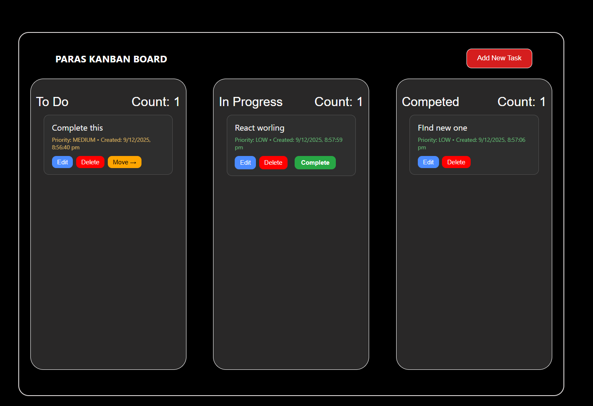

## 📌 Kanban Task Management Board

- A simple and powerful Kanban Board Web App made using HTML, CSS, JavaScript, with full LocalStorage support.
- You can add tasks, edit them, delete them, move them between columns, set priority, and manage your workflow easily.

## 🚀 Features
### ✔ ADD TASK

1. Add task with name

2. Choose priority (Low / Medium / High)

3. Stores created date & time

### ✔ EDIT TASK

1. Edit task name

2. Edit priority

3. Auto-updates in localStorage

### ✔ DELETE TASK

Built-in confirmation popup

1. Deletes the task from correct column

2. Updates count automatically

### ✔ MOVE TO PROGRESS

1. Move tasks from To Do → In Progress

2. Auto count update

3. LocalStorage save

### ✔ MOVE TO COMPLETED

1. From In Progress → Completed

2. Complete button automatically removed

3. Count sync perfectly

### ✔ PRIORITY SYSTEM

1. Low (🟢)

2. Medium (🟡)

3. High (🔴)

4. Colored labels

### ✔ LOCAL STORAGE

1. All tasks remain saved even after refresh

2. Stores:

3. Task name

4. Column (Todo / Progress / Completed)

5. Priority

6. Created date

7. Automatic restore

### ✔ RESPONSIVE

1. Works on

2. Mobile

3. Tablets

4. Desktop

5. Column stacking on smaller screens

## 🛠️ Tech Stack
Technology	Used For
HTML	Structure
CSS	Styling + Responsive Design
JavaScript	Logic + DOM Handling
Local Storage	Saving Tasks Offline

## 📂 Project Structure
/project-folder
│── index.html
│── index.css
│── index.js
└── README.md

## 🔴 Live Demo  
👉 (https://paras9771.github.io/Kanban-Task-Management-Board/)

## 📸 Screenshots (Add These After Upload)

## ▶️ How to Use

1. Click Add New Task

2. Enter task name

3. Choose priority

4. Task appears in To Do

5. Move it to Progress

6. Move it to Completed

7. Delete or Edit anytime

8. Data auto-saves in localStorage

## 🔮 Future Enhancements (Optional Section)

1. Drag and Drop system

2. Light/Dark theme switch

3. Sorting by date or priority

4. User login system

5. Search bar or Filter by priority

## 👤 Author

Paras Tomar
B.Tech CSE
A passionate frontend + JS developer
